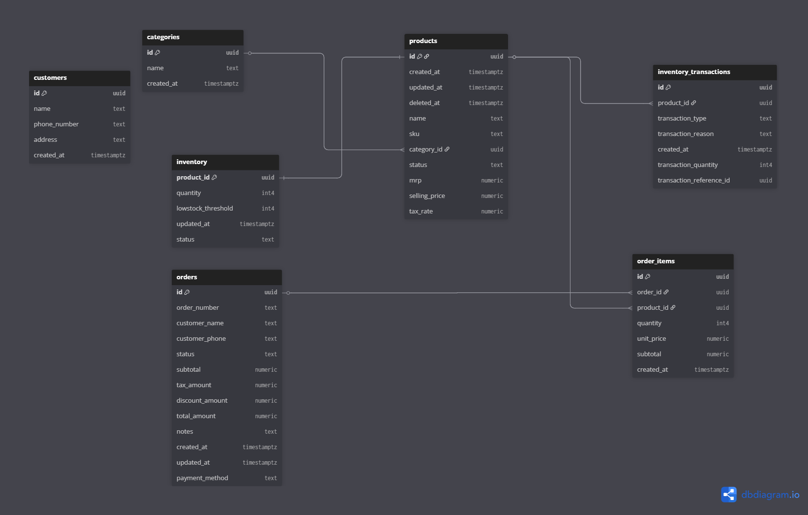

# 🗄 Database Design

## 🎯 Design Goals

- Ensure data integrity
- Prevent invalid states
- Support transactional operations
- Maintain clear relationships

---

## 📦 Core Entities

### Products

- Stores product details
- Soft delete via `deleted_at`
- SKU uniquely identifies product
- Linked to categories

---

### Inventory

- One-to-one with product (`product_id` as PK)
- Tracks:
  - quantity
  - low stock threshold
  - status

---

### Inventory Transactions

- Audit log of all stock changes
- Tracks:
  - type (add/reduce)
  - reason
  - quantity
  - reference (order/manual)

---

### Orders

- Stores order-level data
- Includes:
  - order id
  - generated order_number
  - customer info (optional)
  - subtotal (item total)
  - tax
  - total (subtotal + tax)
  - payment method

---

### Order Items

- Line items for each order
- Links order ↔ product
- Stores:
  - quantity
  - unit price
  - subtotal

---

### Customers

- Optional customer tracking
- Supports:
  - guest checkout
  - saved customer data

---

### Categories

- Product grouping
- Enforced unique name

---

## 🔗 Relationships

- products → categories (many-to-one)
- inventory → products (one-to-one)
- inventory_transactions → products (many-to-one)
- orders → order_items (one-to-many)
- order_items → products (many-to-one)

---

## 🛡 Constraints & Integrity

- SKU uniqueness enforced at DB level
- Phone number unique for customers
- Order number unique
- Foreign keys ensure relational integrity

---

## 🧠 Design Decisions

### Soft Delete (Products)

- Avoid data loss
- Maintain historical references in orders

---

### Separate Inventory Table

- Avoid mixing product data with stock
- Enables locking without affecting product reads

---

### Transaction Log (inventory_transactions)

- Full traceability of stock changes
- Useful for debugging and audits

---

## 🗺 Schema Overview

## ⚠️ Trade-offs

- No multi-warehouse support (single inventory source)
- No advanced indexing optimization yet
- Designed for SMB scale, not high-frequency systems
